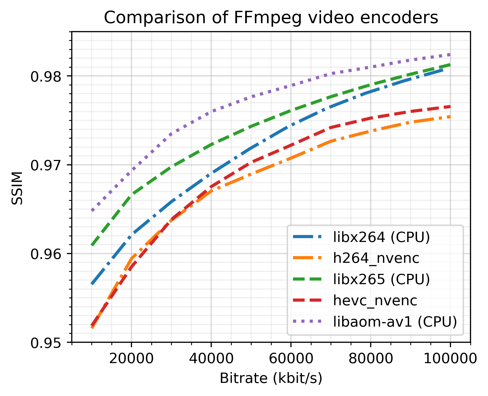
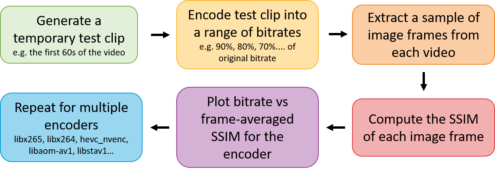

# ffmpeg-encoder-analyser

Repository for comparing the efficiency of FFmpeg encoders using the Structural Similarity Index (SSIM) measure of image quality.
The results of the H.264, H.265 (HEVC) and AV1 encoders as tested on a 4K 100mbit/s sample are shown below.

For a full list of avaiable encoders, use the command:

    ffmpeg -encoders

## Useage

1) Set the INPUT_DIR, INPUT_VIDEO and WORK_DIR in file 1_temp_video_clip.py.
2) Choose the desired clip length (clip_length) and start time (clip_start), then run 1_temp_video_clip.py.
3) Set the WORK_DIR and desired test bitrates (bitrate_tests) in 2_variable_bit_rate.py.
4) Run 2_variable_bit_rate.py to produce the test clips.
5) Set the WORK_DIR in 3_video_analyser.py and run this script.
6) View results in image_quality_results.csv file.

The outline of this project is shown in the diagram below.

